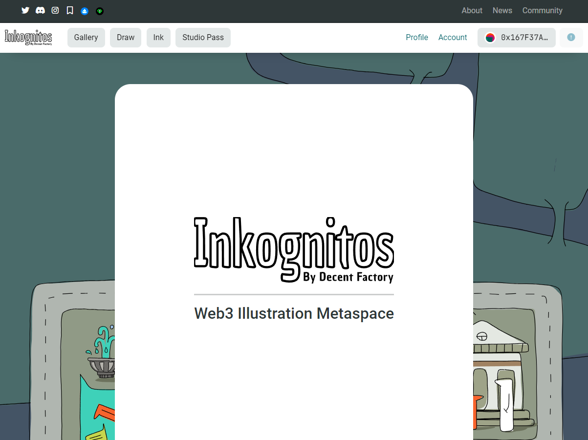
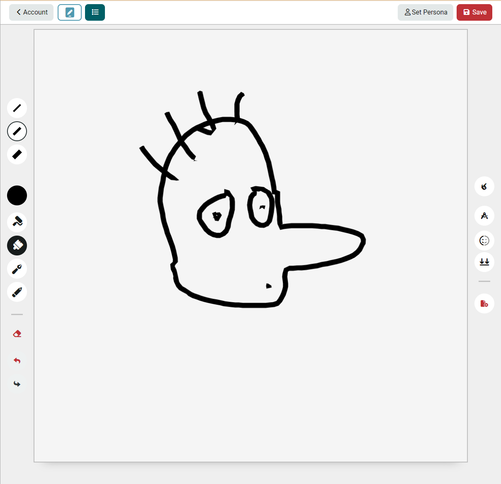
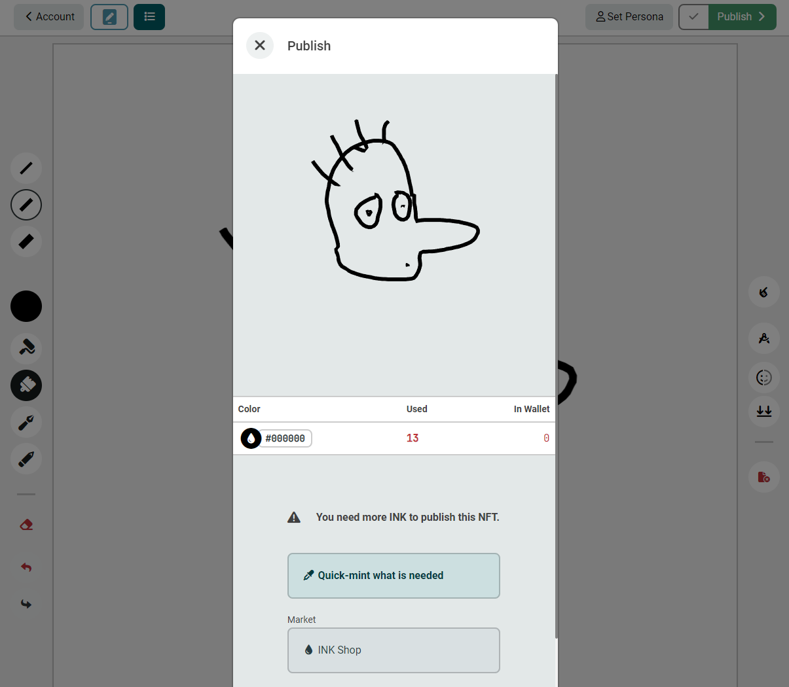
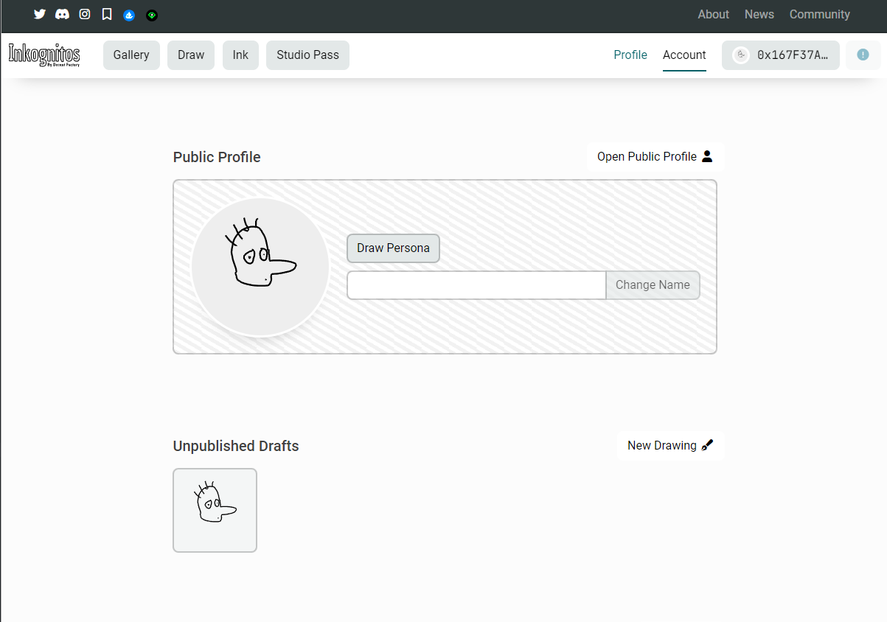
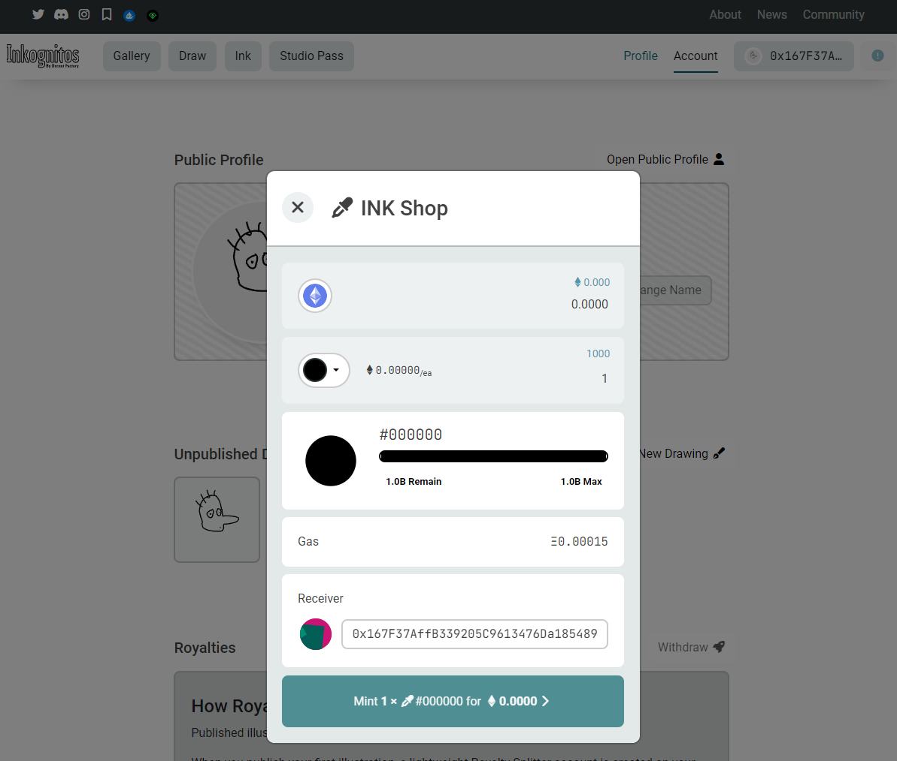

# Inkognitos


## NFT Illustration Metaspace
An innovative NFT platform that allows users to create and publish NFTs using a web-based SVG illustration tool, with royalty splitting and INK token integration.

- 💰 Sales
  - Users can buy [INK](Contract\contracts\InkognitosInk.sol) tokens and publish [Nito](Contract\contracts\InkognitosNFT.sol) tokens
  - Users can buy a [StudioPass](Contract\contracts\INKStudioPass.sol) which allows them to use unlimited INK

- ✍️ Publishing
  - To publish, a user must provide a valid invoice to the NITO contract that asserts the ids and quantities of INK used
  - The publish transaction will deduct the INK from their wallet (or verify their publisher pass)
  - The server uses paper.js to count the quantity of of INK used, and generates a signed invoice of the colors and quantities

- 🔨 Decomposition
  - INK tokens that were used to publish NITOS are stored in the InkUsed contract
  - As an owner of a NITO token, you can "break" the artwork down into its INK, which transfers the INK used to your wallet, and burns the NITO token

- 🪓 Royalty Splitting
  - Royalties are split between the creator and the treasury
  - NITO creator receive royalties from the after-market sales of their NITOS for ever

## Screenshots









## Project

### Frontend

The `/Frontend` directory contains the code for the Vue client. 
This client is responsible for the frontend user interface and interacts with the server to fetch and display data.

### Backend

The `/Backend` directory contains the code for the node server. 
This server is responsible for handling the backend logic and serving the API endpoints.


### Contracts

The `/Contracts` directory contains the code for the Hardat project.

#### 

### Installation

```bash
# Install everything
( cd Backend && yarn ) ; ( cd Frontend && yarn ) ; ( cd Contract && yarn ) ; wait

# Compile contracts
( cd Contract && yarn compile ) ; wait

```

## Usage

### Docker Development Environment
Uses volumes to mount the local directories into the container.
Watches for changes and automatically rebuilds the relevant parts of the project.

```bash
# chmod +x ...sh

# Start development server
...sh dev

```

<https://localhost:30000/>

## Contributing

1. Fork the repository
2. Create a new branch: `git checkout -b feature/your-feature`
3. Make your changes and commit them: `git commit -m 'Add your feature'`
4. Push to the branch: `git push origin feature/your-feature`
5. Submit a pull request

## License

This project is licensed under the [MIT License](LICENSE).